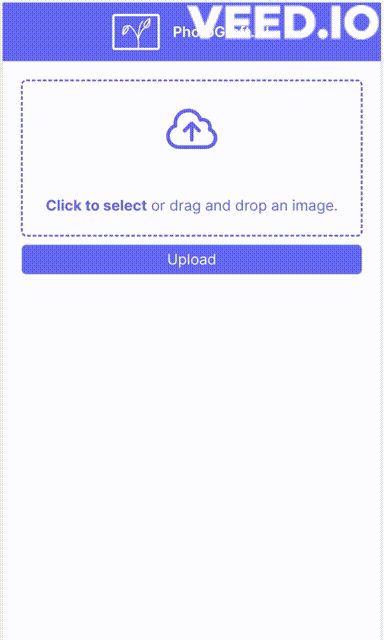

# PhotoGraftAI

A small app that allows you to upload an image and replace certain parts with AI.

(Not as fast in real life :P)

The app utilizes Meta's [Segment Anything Model](https://segment-anything.com/) to create a mask
and [Stable Diffusion's Masked Inpaintaing](https://platform.stability.ai/docs/features/inpainting#Python)
to fill the masked area with given prompt.

## Technical details

The SAM embeddings are calculated via [Replicate.com](https://replicate.com/sepal/sam-embeddings/versions/6169e3d14e9d16d2efd9caf122c94cc4aa916ccef7ae2f85afc930a874beffd9)
and stored using [Xata.io](https://xata.io/)'s new File storage system. A GRPC service then loads
the embeddings and predicts the mask, which in turn is stored again in Xata.io. The application
finally sends the image, mask and prompt to Stability AI's API and stores and calculates the
embeddings for the generated image, so the user can keep editing.
